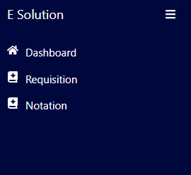
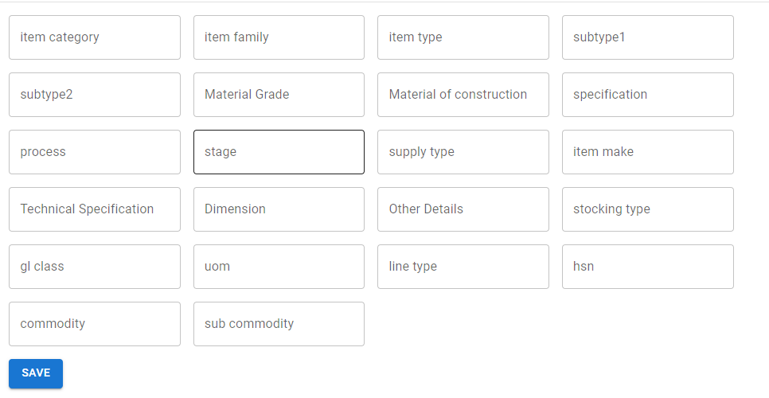
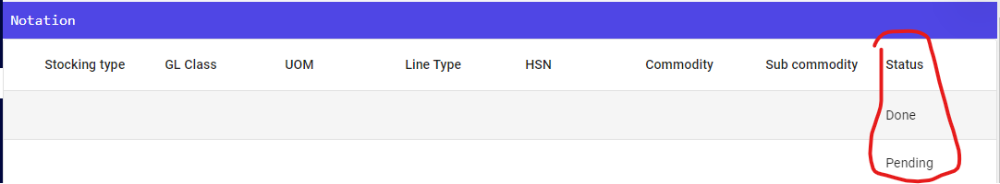

## Quick Notation

1. Click on notation menu from sidebar

2. You can see there is form below the table data.

3. Fill the missing data in the respective field.
4. Hit the save button.
5. holaaa you are done.

The admin will now see your requested notation and create it from there side. After that it will be reflected soon in the dropdown of the requisition form.

You can also watch the status of your notation in the last column of the table data available in notation screen.

