# Overview of the Admin Panel
The Admin Panel is a comprehensive tool designed to streamline various administrative functions within our system. Below is an overview of its key features:

## Key Features
1. Item Management: Easily add new items to the system, ensuring accurate inventory tracking.
2. Material Relationships: Establish connections between different materials, enhancing resource management.
3. User Management
User Creation: Quickly create new user accounts, facilitating team expansion and management.
4. Role Assignment: Assign specific permissions and authority levels to newly created users.
5. User Status Management: Mark users as active or inactive, ensuring appropriate access control.
Password Management: Change user passwords efficiently to maintain security protocols.
6. Reporting and Data Management
Comprehensive Reporting: Access detailed reports to monitor activities and performance metrics.
7. Filtering Options: Utilize filtering capabilities to customize report views based on specific criteria.
8. Data Export: Export reports in various formats, including PDF and Excel, for easy sharing and analysis.
The Admin Panel is designed to provide a user-friendly interface while delivering powerful functionalities to enhance administrative efficiency and control.

## Login to admin

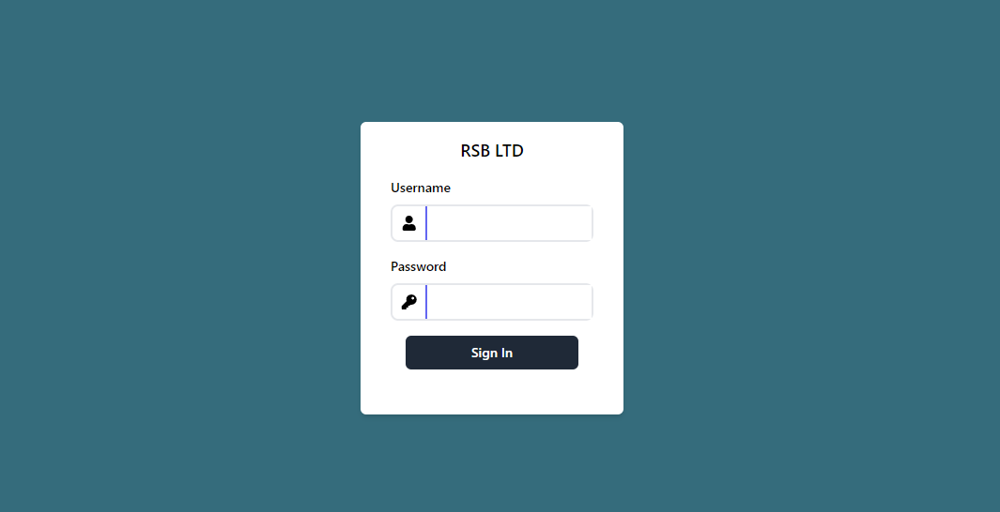

## Admin Dashboard

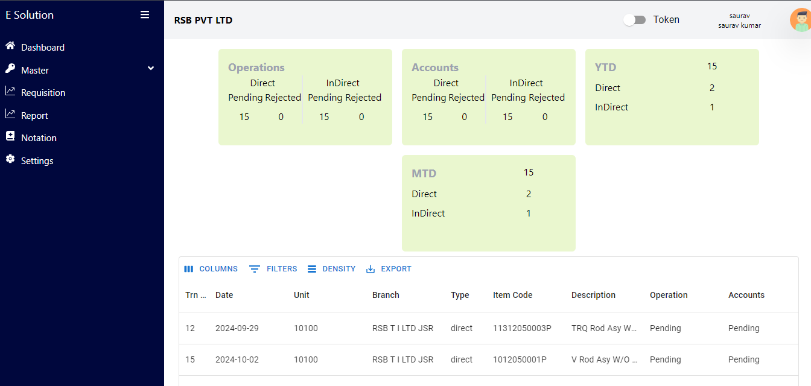

## Add Item Category

1. Click on Master menu from the sidebar.

    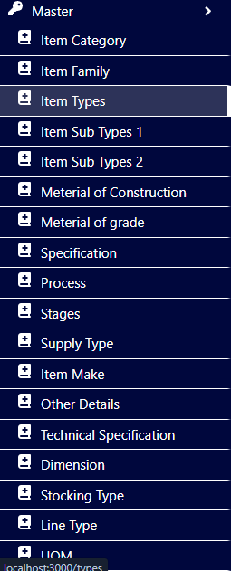

2. Click on the Item Category.

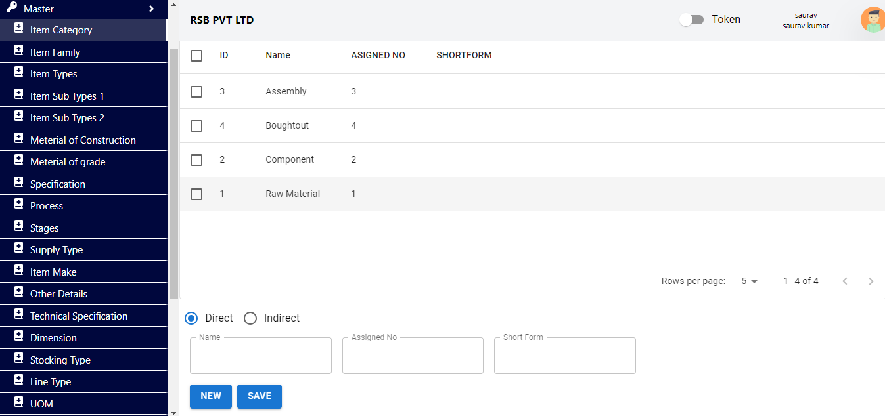

3. To create new category first select the one of the radio button that is direct or indirect.
4. Fill the category name in name field and you must assign a unique number to the them. Please fill the unique assigned number in assignedNo field.
4. Click on save button

## Edit Item Category

1. Click on the Item Category from the sidebar under master.
2. Click on any row of the table you want to edit.
3. Now edit the details.
4. And hit save. 

## Add Item Family

1. Click on the item family from the sidebar.
2. You will see a option to create the item family below the table like below.

    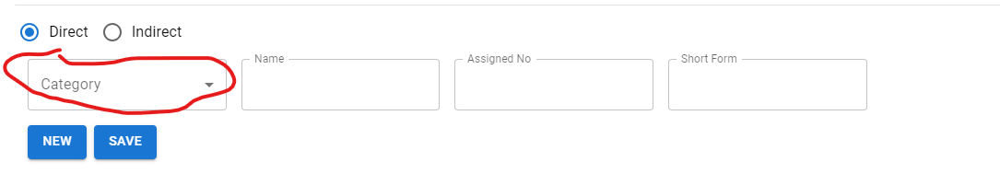

4. First selct the radio button i.e Direct or Indirect.
5. Select the Category from dropdown you are creating the item family for.
6. Fill the Item family name in Name field.
7. Assigned a unique number for the item family which not already present earlier.
8. Enter the unique assigned Number in assigned No field.
9. Click on Save.

## Edit Item Family
1. Click on the item family from the sidebar.
2. Click on any row of the table you want to edit.
3. Now edit the details.
4. And hit save. 

## Add Item Types

1. Click on the Item Types menu from the sidebar.
2. You will see below form in the buttom of the table.

    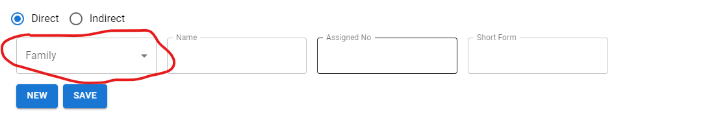

3. Select the family from the dropdown.
4. Enter the Item type name in Name field.
5. Assign a unique number in the assign No field which is not used earlier.
6. Now hit save button to save the item family.

## Edit Item Types
1. Click on the Item Types menu from the sidebar.
2. Click on any row of the table you want to edit.
3. Now edit the details.
4. And hit save. 

## Add Item SubTypes1

1. Click on the Item SubType1 menu from the sidebar.
2. Select the radio button.
3. Select the item type from dropdown.

    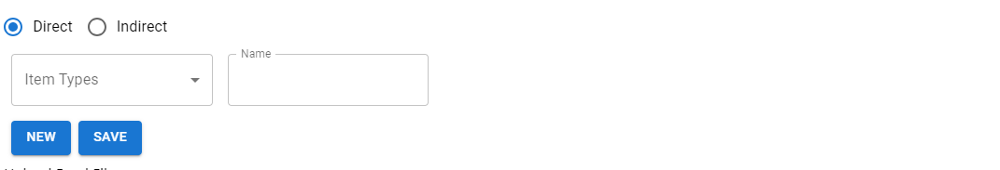

4. Enter the subtype1 name in the name field.
5. Hit save button to save the data.

## Edit Item SubTypes1

1. Click on the Item SubType1 menu from the sidebar.
2. Click on any row of the table you want to edit.
3. Now edit the details.
4. And hit save. 

## Add Item SubTypes2

1. Click on the Item SubType2 menu from the sidebar.
2. Select the radio button as Direct or indirect.
3. Select the item type from dropdown.

    

4. Enter the subtype2 name in the name field.
5. Hit save button to save the data.

## Edit Item SubTypes2

1. Click on the Item SubType2 menu from the sidebar.
2. Click on any row of the table you want to edit.
3. Now edit the details.
4. And hit save. 

## Add Material of Construction

1. Click on the Item material of construction menu from the sidebar.
2. Select the radio button as Direct or Indirect.
3. Select the Item Category from the dropdown.

    

4. Enter the name of material of construction.
5. Assign a unique number to the material of construction that has not used earliar.
6. Enter the assigned number in assigned No field.
7. Hit save button to save.

## Edit Material of Construction
1. Click on the Item material of construction menu from the sidebar.
2. Click on any row of the table you want to edit.
3. Now edit the details.
4. And hit save. 

## Add Material Grade
1. Click on the Item material grade menu from the sidebar under master.
2. Select the radio button as Direct or Indirect.

    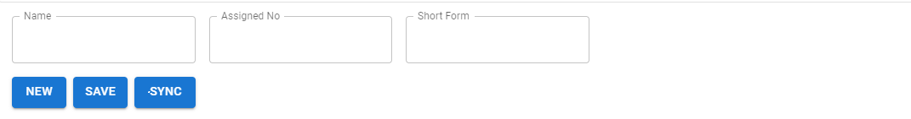

4. Enter the name of material grade.
5. Do not enter any assigned No and short form details.
7. Hit save button to save.

## Edit Material Grade

1. Click on the Item material grade menu from the sidebar under master.
2. Click on any row of the table you want to edit.
3. Now edit the details.
4. And hit save. 

## Add Specification
1. Click on the Specification menu from the sidebar under master.
2. Select the radio button as Direct or Indirect.

    

3. Enter the name of specification.
4. Do not enter any assigned No and short form details.
5. Hit save button to save.

## Edit Specification

1. Click on the Specification menu from the sidebar under master.
2. Click on any row of the table you want to edit.
3. Now edit the details.
4. And hit save. 

## Add Process
1. Click on the Process menu from the sidebar under master.
2. Select the radio button as Direct or Indirect.

    

3. Enter the name of process.
4. Assigne a unique number for the process that has not used earliar.
5. Fill the assigned number in assigned No field
6. Hit save button to save.

## Edit Process

1. Click on the Process menu from the sidebar under master.
2. Click on any row of the table you want to edit.
3. Now edit the details.
4. And hit save. 

## Add Stages
1. Click on the Stages menu from the sidebar under master.
2. Select the radio button as Direct or Indirect.

    

3. Enter the name of Stages.
4. Assigne a unique number for the Stages that has not used earliar.
5. Fill the assigned number in assigned No field
6. Hit save button to save.

## Edit Stages

1. Click on the Stages menu from the sidebar under master.
2. Click on any row of the table you want to edit.
3. Now edit the details.
4. And hit save. 

## Add Supply Type
1. Click on the Supply Type menu from the sidebar under master.
2. Select the radio button as Direct or Indirect.

    

3. Enter the name of Supply Type.
4. Assigne a unique number for the Supply Type that has not used earliar.
5. Fill the assigned number in assigned No field
6. Hit save button to save.

## Edit Supply Type

1. Click on the Supply Type menu from the sidebar under master.
2. Click on any row of the table you want to edit.
3. Now edit the details.
4. And hit save. 

## Add Item make
1. Click on the Item make menu from the sidebar under master.
2. Select the radio button as Direct or Indirect.

    

3. Enter the name of Item make.
4. Do not enter any assigned No and short form details.
5. Hit save button to save.

## Edit Item make

1. Click on the Item make menu from the sidebar under master.
2. Click on any row of the table you want to edit.
3. Now edit the details.
4. And hit save. 

## Add Other Details
1. Click on the Other Details menu from the sidebar under master.
2. Select the radio button as Direct or Indirect.

    

3. Enter the name of Other Details.
4. Do not enter any assigned No and short form details.
5. Hit save button to save.

## Edit Other Details

1. Click on the Other Details menu from the sidebar under master.
2. Click on any row of the table you want to edit.
3. Now edit the details.
4. And hit save. 

## Add Technical Specification
1. Click on the Technical Specification menu from the sidebar under master.
2. Select the radio button as Direct or Indirect.

    

3. Enter the name of Technical Specification.
4. Do not enter any assigned No and short form details.
5. Hit save button to save.

## Edit Technical Specification

1. Click on the Technical Specification menu from the sidebar under master.
2. Click on any row of the table you want to edit.
3. Now edit the details.
4. And hit save. 

## Add Dimension
1. Click on the Dimension menu from the sidebar under master.
2. Select the radio button as Direct or Indirect.

    

3. Enter the name of Dimension.
4. Assigne a unique number for the Dimension that has not used earliar.
5. Fill the assigned number in assigned No field
6. Hit save button to save.

## Edit Dimension

1. Click on the Dimension menu from the sidebar under master.
2. Click on any row of the table you want to edit.
3. Now edit the details.
4. And hit save. 

## Stocking Type

No Need to create new Stocking Type. The Stocking Type will always sync from the JD Server.

### sync the Stocking Type

#### Note before sync please enable the token switch button available on the top right of the navbar.

1. Click on Stocking Type menu from the sidebar under master menu.
2. Click on sync button available in the buttom of the screen.
       

## Line Type

No Need to create new Line Type. The Line Type will always sync from the JD Server.

### sync the Line Type

#### Note before sync please enable the token switch button available on the top right of the navbar.

1. Click on Line Type menu from the sidebar under master menu.
2. Click on sync button available in the buttom of the screen.
      

## Unit of Measurement

No Need to create new Unit of Measurement. The Unit of Measurement will always sync from the JD Server.

### sync the Unit of Measurement

#### Note before sync please enable the token switch button available on the top right of the navbar.

1. Click on UOM menu from the sidebar under master menu.
2. Click on sync button available in the buttom of the screen.
         

## GL Class

No Need to create new GL Class. The GL Class will always sync from the JD Server.

### sync the GL Class

#### Note before sync please enable the token switch button available on the top right of the navbar.

1. Click on GL Class menu from the sidebar under master menu.
2. Click on sync button available in the buttom of the screen.
     

## HSN Code

No Need to create new HSN Code. The HSN Code will always sync from the JD Server.

### sync the HSN Code

#### Note before sync please enable the token switch button available on the top right of the navbar.

1. Click on HSN Code menu from the sidebar under master menu.
2. Click on sync button available in the buttom of the screen.
     

## Commodity Class

No Need to create new Commodity Class. The Commodity Class will always sync from the JD Server.

### sync the Commodity Class

#### Note before sync please enable the token switch button available on the top right of the navbar.

1. Click on Commodity Class menu from the sidebar under master menu.
2. Click on sync button available in the buttom of the screen.
     

## Commodity Sub Class

No Need to create new Commodity Sub Class. The Commodity Sub Class will always sync from the JD Server.

### sync the Commodity Sub Class

#### Note before sync please enable the token switch button available on the top right of the navbar.

1. Click on Commodity Sub Class menu from the sidebar under master menu.
2. Click on sync button available in the buttom of the screen.
     

## Admin Requisition Validation

1. Click on requisition menu from sidebar.

You will see large number of column in the table. And When you scroll the column. You will see there is a option to approve in the last column of table like below.

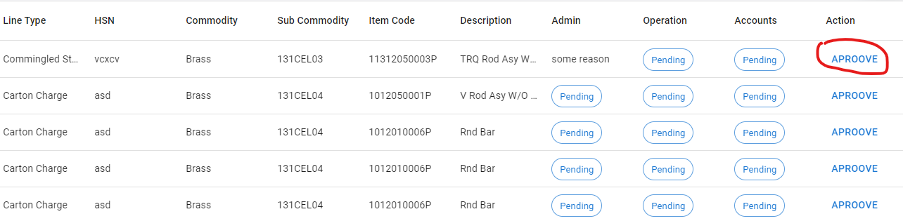

2. Click on the approve button.

### You will see a pop up appears on the screen.

3. Click on approve button if you want to approve.
4. Click on reject button if you want to reject.
5. A remarks field will appear if you click on the reject button like below.

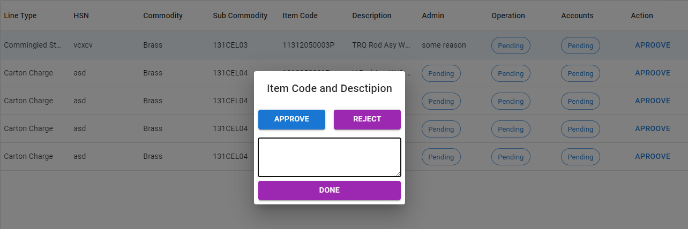

6. Please fill the remarks and than click on done.

### Now the requisition is rejected and status will be reflected in the end user side.

## Push to JD

1. Click on requisition menu from sidebar.

    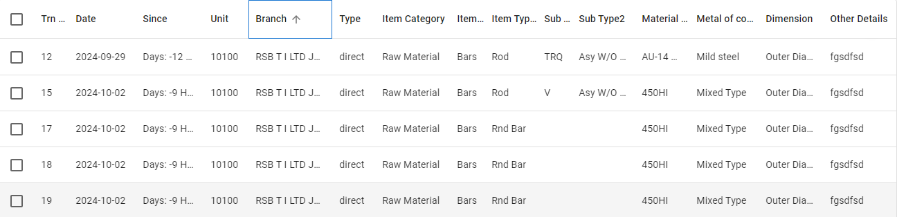

2. Select all checkBox of the requisition you want to push to JD.
3. Click on Push Button available in the buttom of the table like below

    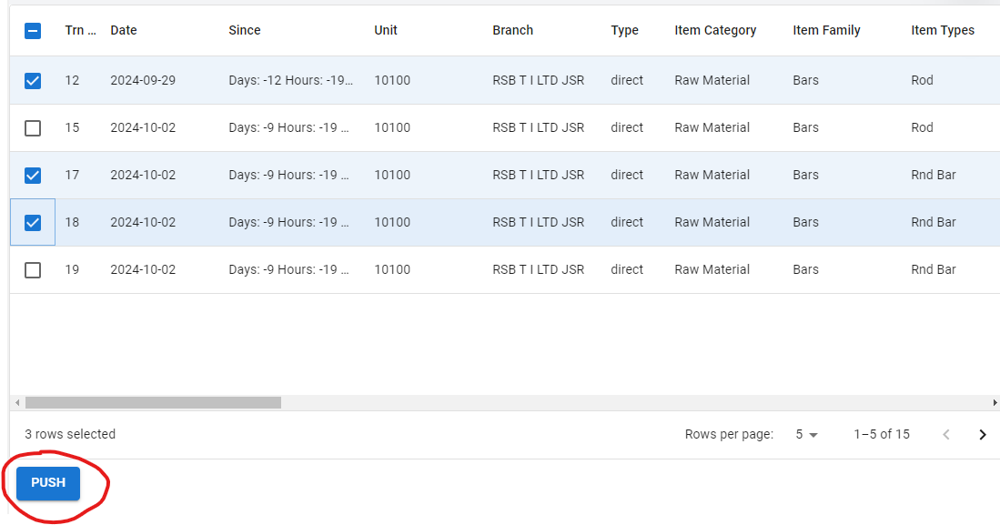

## Export report to excel and pdf.

1. Click on Report menu from sidebar under master menu.
2. Below is the report where you can filter and export to pdf and excel.

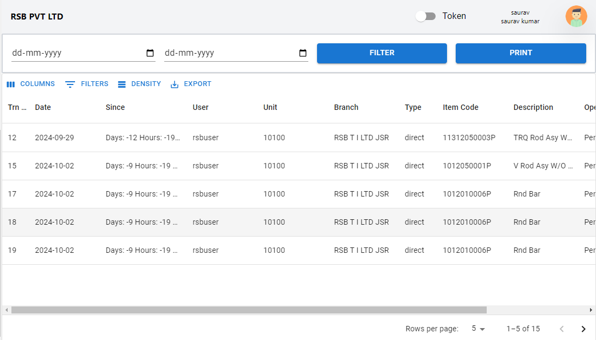

## Admin Notation
1. Click on Notation menu from sidebar .
2. Below is the notation request.

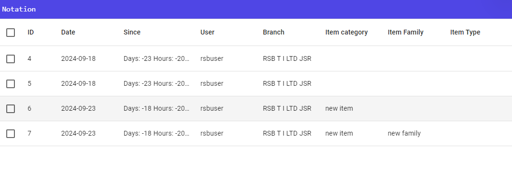

3. Click on row of notation to mark as done if it is created successfully.

4. Click on approve button available in the buttom of the screen like below.

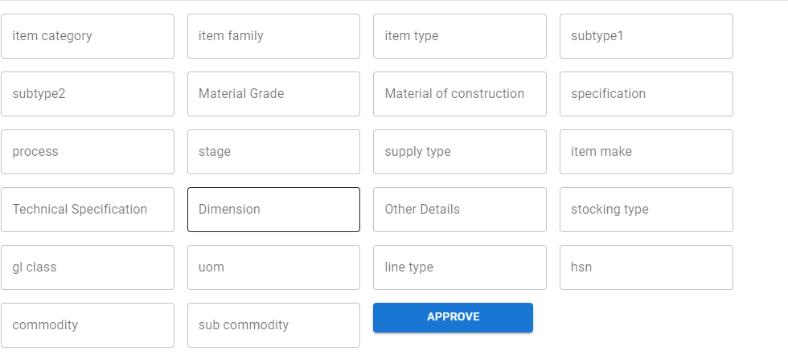

## Settings.

1. Click on Setting menu from sidebar .
2. You will find two tabs. One is USERS and other is BRANCH

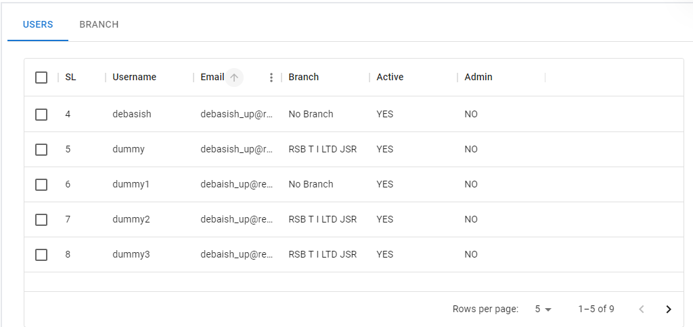

### Note :- You can create, edit, give role, allocate branch to user, mark as active and inactive and change user password from USER tab.

### While You can only fetch the available branch from the JD in BRANCH tab.

## Create new user

1. Click on Setting menu from sidebar .
2. Go to USER tab.
3. Fill the below details.

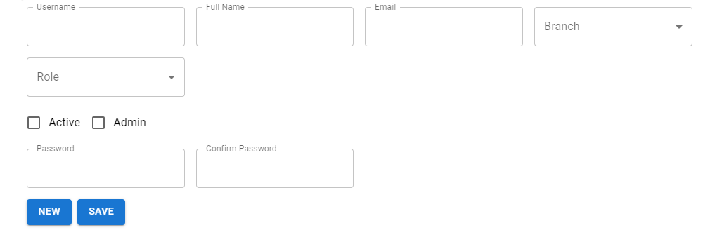

4. Hit the save button.

## Edit user.

1. Click on Setting menu from sidebar .
2. Go to USER tab.
3. Select the user row from the table
4. edit the user details.

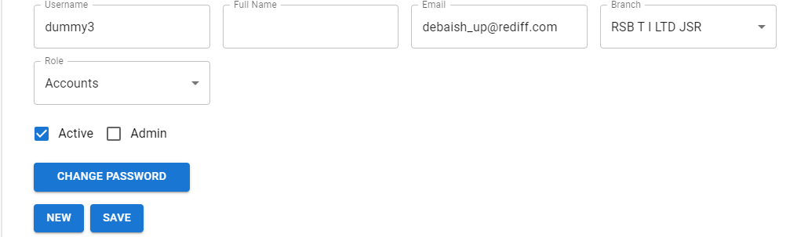

5. Hit save to apply the changes.

## Change user password.

1. Click on Setting menu from sidebar .
2. Go to USER tab.
3. Select the user row from the table

4. Click on change Password button.

5. A pop will appear to change the password like below.

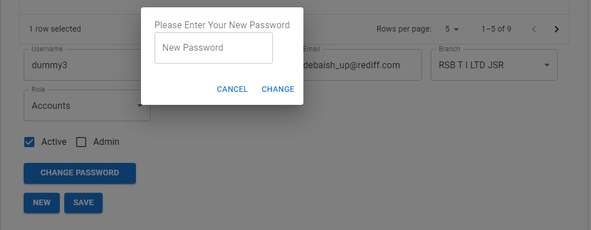

6. Enter the new password.
7. Hit the change button to apply changes.

## Sync Branch

#### Note before sync please enable the token switch button available on the top right of the navbar.

1. Click on Setting menu from sidebar .
2. Go to BRANCH tab.
3. Click on the Sync button available on the buttom of the screen.

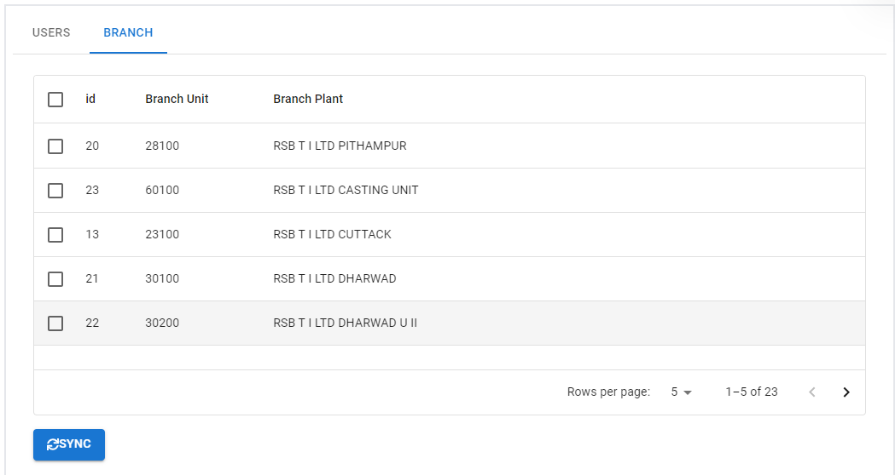

