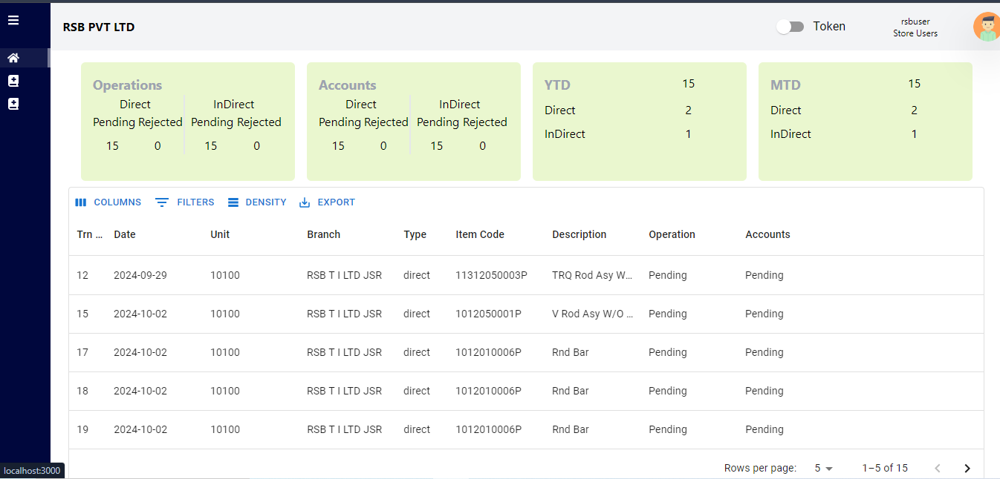
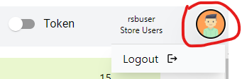
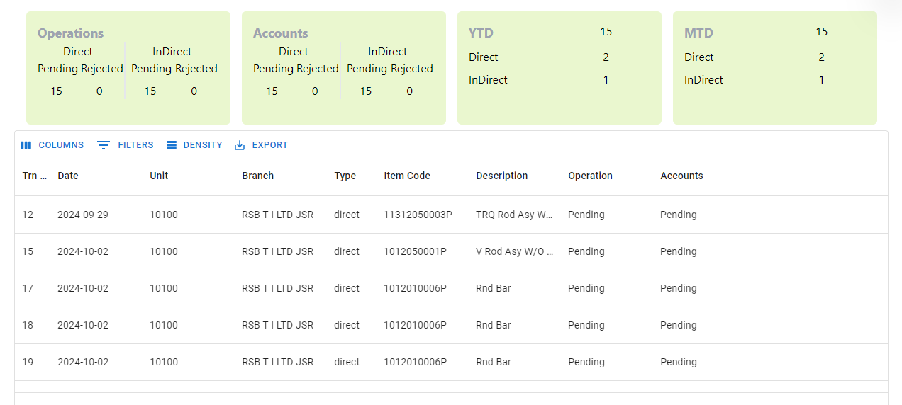

## Dashboard

This is your dynamic dashboard

## Let us break down the key features available on the dashboard

1. Hamburger button to minimize and maximize the sidebar.

2. A switch button to connect to JD SERVER before going to requisition. 

3. User details will be on the top right corner. And logout button will appear after clicking on your Avatar image. 

4. And below are the real time requisition data and current status of the requisition.

