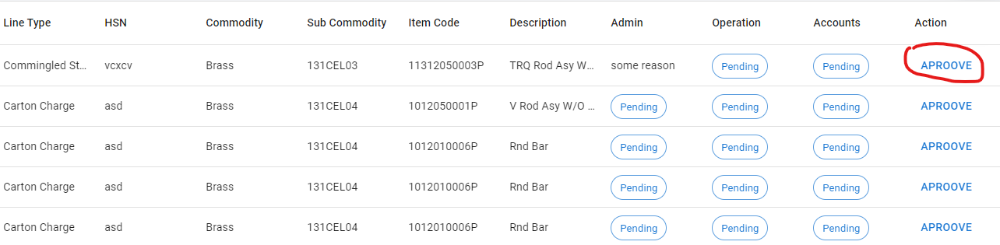
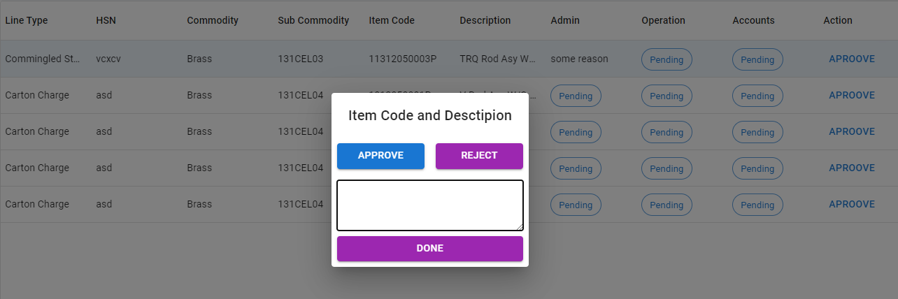

## Validation of Requition

The validation of requisition data has three step varification.

The Validation process are similar for all department like Operation, Accounts and Admin.

### Lets us see step by step process to validate the requisition
1. Go to the login screen using the this url http://rsbitem.rsbglobal.com .

2. Enter Your cruedential provided by administration and click on Sign In Button.
3. You will see the exact screen like below.

### The screen of both Operation and Accounts is same.
4. Now click on requisition. This will redirect you to the requisition list screen like below.

You will see large number of column in the table. And When you scroll the column. You will see there is a option to approve in the last column of table like below.

5. Click on the approve button.

### You will see a pop up appears on the screen.

6. Click on approve button if you want to approve.
7. Click on reject button if you want to reject.
8. A remarks field will appear if you click on the reject button like below.

9. Please fill the remarks and than click on done.

### Now the requisition is rejected and status will be reflected in the end user side.