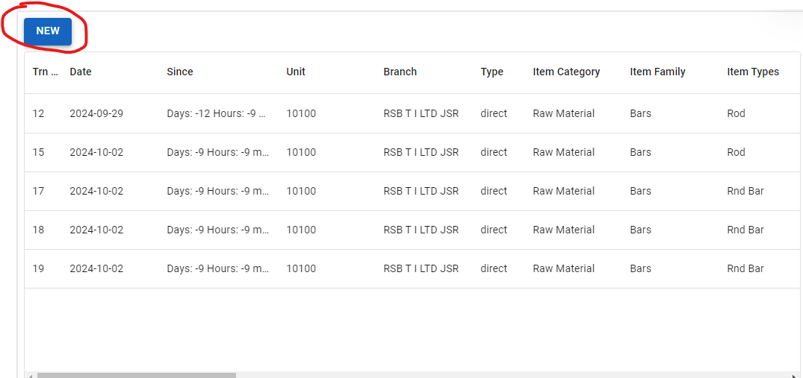
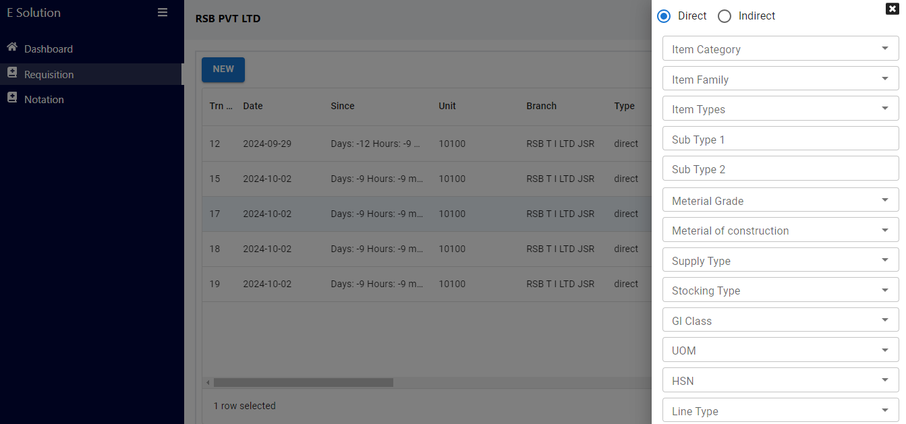
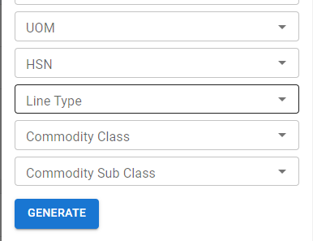

## Quick Requisition

### Lets us see how we can create a new requisition.
1. Please switch on the token button.

2. Go to Sidebar available in the left side. That will look like below.

3. Click on the requisition button.

4. Click on the New Button

5. This will open your requisition form in the right side of the window like below.

6. Fill each field of the requisition form carefully and sequentially.
7. Then click on the generate button 

8. This will create the item code and description and also validate it at the same time.

9. If the item code and description not found. It will allow you to save the requisition otherwise not.

## Notation

Let us know what you will do if some data not found in any of the dropdown field.
We can request the admin to add that data to the dropdown from the Notation. Which is available in the left sidebar.

### You will see a detail of Notation in next Screen.